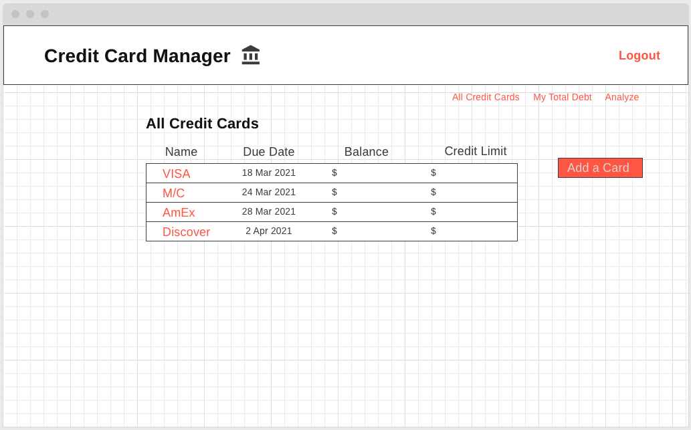

# CREDIT CARD MANAGER APP
The Credit Card Manager is an app that will allow a user to enter credit card information. It features a tool to project accelerated payments and gauge the benefits of eliminating credit-card debt by showing the savings in interest charges that the user can realize by accelerating payments.

## Minimum Viable Product (MVP)
- Full CRUD implementation.
- Full stack application using MERN functionality (Mongoose, Express, React, Node.js).
- Models, Views and Controllers (MVC) structure.
- Deployed online and accessible to the public.
- Git repository with daily commits.

## New Technologies
- Styled Components - CSS-in-JS tool that uses a conbination of Tagged Template Literals (a recent addition to Java Script) and CSS to apply easy-to-manage styles to React components 
[Links](https://styled-components.com/).
- Implementation of graphs in front end using Recharts 
[Links](https://recharts.org/en-US).
- Functional React - funtional components with hooks to enable state in functions.
[Links](https://reactjs.org/docs/hooks-state.html)
- PropType validation.
[Links](https://reactjs.org/docs/typechecking-with-proptypes.html)

## Stretch Goals
- Authorization - sign up/log in functionality.

# User Story
As a user, I can:
- create an account
- login to my account
- log off from my account
- create credit-card instances 
- for each credit-card instance, I can enter 
    - name
    - account number
    - bank
    - bank address for payment remittance 
    - costumer-service information
    - credit limit
    - current balance
    - due date
    - minimum payment
    - interest rate
    - annual fee (if any)
- see how much I am paying monthly in total credit card debt
- see how long it will take to pay off the credit card balance if I only pay the minimum payment
- see how much I need to pay monthly if I want to pay off the credit card balance by a given date
- see the impact that a larger monthly payment will have in the payment time and in the interest I will end up paying by the time the credit card is paid off.
- see a graph that compares the pay-off time of a credit card if I only pay the minimum balance vs. making accelerated payments
- see how much I will pay in interest by the time I pay the credit-card balance if I only pay the minimum payment required
- see a graph that compares how much interest and how much principal I will pay over the payoff period at minimum payment
- see a graph that compares how much interest and how much principal I will pay over the payoff period with accelerated payments
- see how much I will pay in interest by the time I pay the credit card balance if I accelerate payments.
- see my total credit-card debt
- update the information of any credit card instance	
- delete any of the credit card instances

# Wireframing

## Landing page

## All credit cards view

## Add a credit card view

## Individual credit card view

## Update credit card view

## Credit card analysis view

# Stretch

## Login prompt

